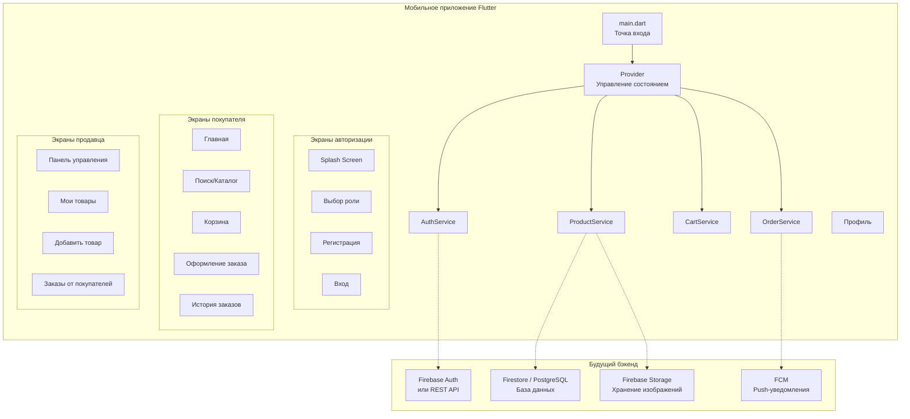
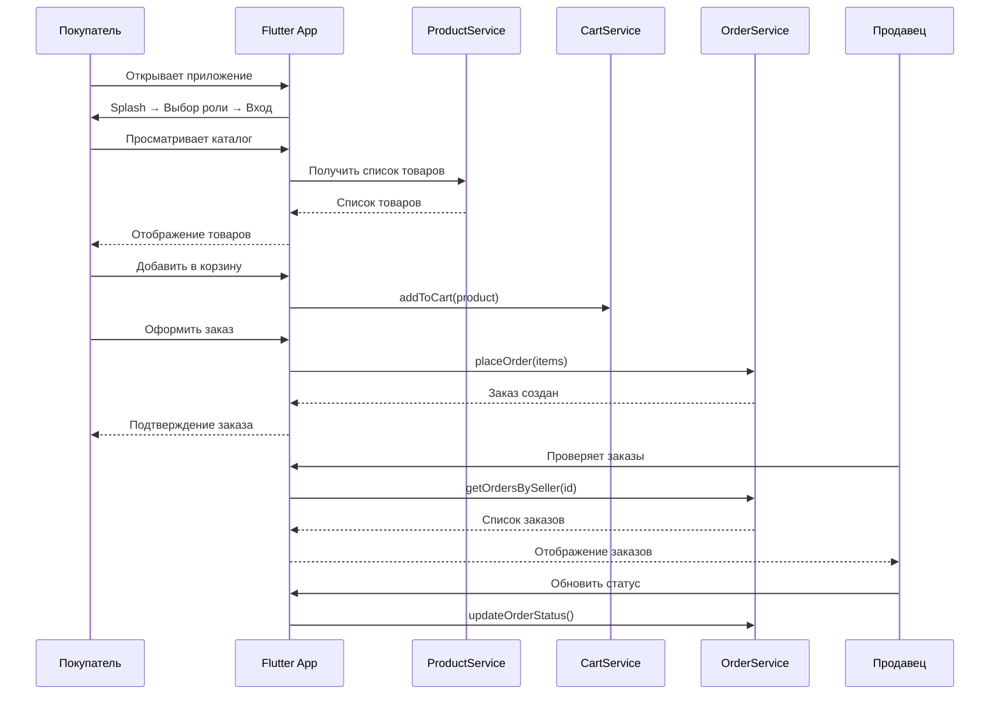
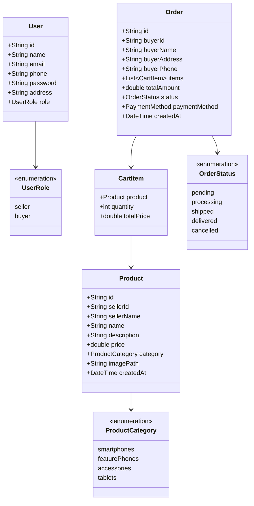

# Архитектура системы Mobile Market

## Диаграмма архитектуры

```mermaid
graph TD
    subgraph "Мобильное приложение Flutter"
        A["main.dart<br/>Точка входа"] --> B["Provider<br/>Управление состоянием"]
        
        B --> C["AuthService"]
        B --> D["ProductService"]
        B --> E["CartService"]
        B --> F["OrderService"]
        
        subgraph "Экраны авторизации"
            G["Splash Screen"]
            H["Выбор роли"]
            I["Регистрация"]
            J["Вход"]
        end
        
        subgraph "Экраны покупателя"
            K["Главная"]
            L["Поиск/Каталог"]
            M["Корзина"]
            N["Оформление заказа"]
            O["История заказов"]
        end
        
        subgraph "Экраны продавца"
            P["Панель управления"]
            Q["Мои товары"]
            R["Добавить товар"]
            S["Заказы от покупателей"]
        end
        
        T["Профиль"]
    end

    subgraph "Будущий бэкенд"
        U["Firebase Auth<br/>или REST API"]
        V["Firestore / PostgreSQL<br/>База данных"]
        W["Firebase Storage<br/>Хранение изображений"]
        X["FCM<br/>Push-уведомления"]
    end

    C -.-> U
    D -.-> V
    D -.-> W
    F -.-> X
```

## Диаграмма потока данных

```mermaid
sequenceDiagram
    participant B as Покупатель
    participant App as Flutter App
    participant PS as ProductService
    participant CS as CartService
    participant OS as OrderService
    participant S as Продавец

    B->>App: Открывает приложение
    App->>B: Splash → Выбор роли → Вход
    B->>App: Просматривает каталог
    App->>PS: Получить список товаров
    PS-->>App: Список товаров
    App-->>B: Отображение товаров
    B->>App: Добавить в корзину
    App->>CS: addToCart(product)
    B->>App: Оформить заказ
    App->>OS: placeOrder(items)
    OS-->>App: Заказ создан
    App-->>B: Подтверждение заказа
    
    S->>App: Проверяет заказы
    App->>OS: getOrdersBySeller(id)
    OS-->>App: Список заказов
    App-->>S: Отображение заказов
    S->>App: Обновить статус
    App->>OS: updateOrderStatus()
```

## Диаграмма классов (модели)

```mermaid
classDiagram
    class User {
        +String id
        +String name
        +String email
        +String phone
        +String password
        +String address
        +UserRole role
    }
    
    class Product {
        +String id
        +String sellerId
        +String sellerName
        +String name
        +String description
        +double price
        +ProductCategory category
        +String imagePath
        +DateTime createdAt
    }
    
    class CartItem {
        +Product product
        +int quantity
        +double totalPrice
    }
    
    class Order {
        +String id
        +String buyerId
        +String buyerName
        +String buyerAddress
        +String buyerPhone
        +List~CartItem~ items
        +double totalAmount
        +OrderStatus status
        +PaymentMethod paymentMethod
        +DateTime createdAt
    }
    
    class UserRole {
        <<enumeration>>
        seller
        buyer
    }
    
    class ProductCategory {
        <<enumeration>>
        smartphones
        featurePhones
        accessories
        tablets
    }
    
    class OrderStatus {
        <<enumeration>>
        pending
        processing
        shipped
        delivered
        cancelled
    }
    
    User --> UserRole
    Product --> ProductCategory
    CartItem --> Product
    Order --> CartItem
    Order --> OrderStatus
```
